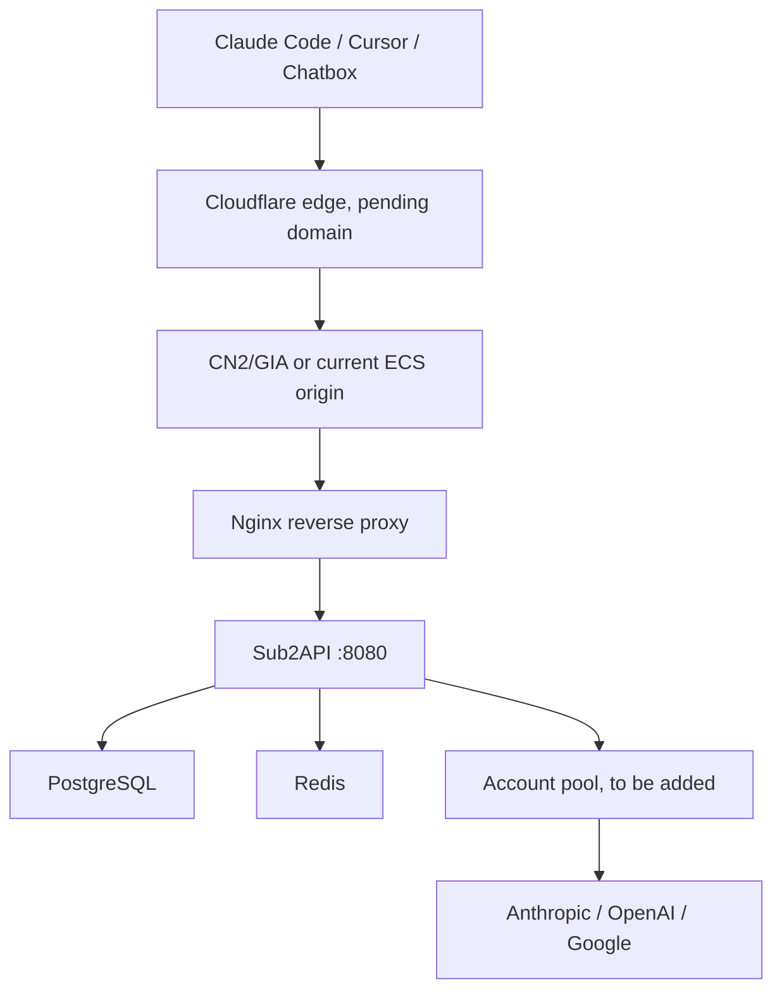

# DGWay API Personal Gateway

这份记录用于整理当前 DGWay API 的雏形状态，以及后续加入号池时需要做的事情。不要把真实 API Key、Cookie、OAuth refresh token、数据库密码写进这个文件。

## 当前状态

- 项目名称：DGWay API
- 入口地址：http://8.148.191.211/home
- 服务器：阿里云 ECS，Ubuntu 24.04，公网 IP `8.148.191.211`
- SSH：

```bash
ssh -i ~/.ssh/aliyun_tokera_ed25519 root@8.148.191.211
```

- Sub2API 工作目录：`/opt/sub2api`
- 主服务：`sub2api.service`
- 监听方式：Sub2API 监听 `127.0.0.1:8080`，Nginx 对外提供 `80` 端口反向代理
- 数据库：PostgreSQL，本机服务
- 缓存：Redis，本机服务
- 品牌配置：
  - `site_name`: `DGWay API`
  - `site_subtitle`: `Personal AI API Gateway`
  - `site_logo`: `/dgway-logo-d.svg`
- Logo 来源：`/Users/goufugui/Desktop/DGWay API/web/default/public/logo.svg`，已直接作为 SVG 部署到服务器，避免 PNG 转换导致画布错位。

## 当前架构



## 已完成的基础雏形

- Sub2API 服务已部署并设置为开机自启。
- Nginx 已配置长连接和流式响应代理，适合 Claude Code、Cursor 这类客户端。
- 站点名称、标题和页脚已经替换为 DGWay API。
- Logo 已改为桌面 `DGWay API/web/default/public/logo.svg` 对应的 D 形图标，并由 Nginx 提供 `/dgway-logo-d.svg`。
- PostgreSQL、Redis、Nginx、Sub2API 均处于可运行状态。
- 已添加每日备份脚本：`/opt/sub2api/ops/dgway-backup.sh`。
- 已添加健康检查脚本：`/opt/sub2api/ops/dgway-healthcheck.sh`。
- 已添加 cron：每天 03:20 自动备份数据库和关键配置。

## 对照教程的落地状态

| 教程环节 | 当前状态 | 说明 |
| --- | --- | --- |
| 国内客户端 | 已可访问 | 当前先用公网 IP `http://8.148.191.211`，域名接入后换成正式 HTTPS 地址。 |
| Cloudflare 边缘节点 | 待域名 | 需要先有域名并接入 Cloudflare，缓存规则和优化项才能配置。 |
| CN2/GIA 服务器 | 部分满足 | 当前 ECS 已能运行 Sub2API；如果后续面向国内稳定访问，建议换或补一台 CN2 GIA/CN2 优化线路机器。 |
| Nginx 反向代理 | 已完成 | 已关闭 `proxy_buffering` 和 `proxy_request_buffering`，并设置长超时。 |
| Sub2API 本地端口 | 已完成 | Sub2API 只监听 `127.0.0.1:8080`，公网只暴露 Nginx `80`。 |
| 号池 | 待你加入 | 后续在后台添加上游账号/API Key，再绑定分组和个人 API Key。 |
| AI 原厂 API | 待你准备 | 需要 Anthropic/OpenAI/Google/Bedrock 等上游凭据。 |

## Nginx 当前关键配置

当前站点配置在 `/etc/nginx/sites-available/dgway-api`：

```nginx
proxy_buffering off;
proxy_request_buffering off;
proxy_read_timeout 3600s;
proxy_send_timeout 3600s;
proxy_set_header Upgrade $http_upgrade;
proxy_set_header Connection "upgrade";
```

这些配置是为了让流式响应和长请求更稳，尤其是 Claude Code、Cursor 这类客户端。

## Cloudflare 接入后要改的地方

等域名准备好后，按这个顺序做：

1. DNS 添加 `A` 记录：`api.your-domain.com -> 8.148.191.211`。
2. Cloudflare SSL/TLS 先用 `Full`，服务器签好证书后改成 `Full (strict)`。
3. 给 API 域名创建 Cache Rule：`Cache eligibility = Bypass cache`。
4. 关闭会影响 API 流式响应的优化项，尤其是自动压缩/改写类功能。
5. Nginx `server_name _;` 改成正式域名。
6. 用 certbot 给域名签 HTTPS 证书。
7. 客户端统一使用 `https://api.your-domain.com`。

## 你后续需要准备

- 域名：例如 `api.your-domain.com`，解析到 `8.148.191.211`。
- HTTPS 证书：建议用 `certbot` 给域名签 Let’s Encrypt 证书。
- 上游账号或官方 API Key：Anthropic、OpenAI、Google Gemini、Bedrock 等，按你的学习目标选择。
- 号池策略：建议先少量账号测试，不要一开始做复杂分摊。
- 访问控制：个人学习阶段建议关闭公开注册，只给自己创建 API Key。
- 备份策略：至少备份 `/opt/sub2api/data/config.yaml` 和 PostgreSQL 数据。

## 加入号池的推荐顺序

1. 登录 DGWay API 后台。
2. 先创建一个测试分组，例如 `personal-claude` 或 `personal-gemini`。
3. 在账号管理里添加一个上游账号或 API Key。
4. 将账号绑定到对应分组。
5. 创建一个个人 API Key，并绑定到该分组。
6. 用客户端测试 OpenAI-compatible 或 Claude-compatible 接口。
7. 观察日志、用量统计、错误率，再逐步增加账号。

## 常用运维命令

查看服务状态：

```bash
systemctl status sub2api nginx postgresql redis-server --no-pager
```

查看 Sub2API 日志：

```bash
journalctl -u sub2api -f
```

重启 Sub2API：

```bash
systemctl restart sub2api
```

检查 Nginx 配置并重载：

```bash
nginx -t && systemctl reload nginx
```

备份数据库：

```bash
/opt/sub2api/ops/dgway-backup.sh
```

健康检查：

```bash
/opt/sub2api/ops/dgway-healthcheck.sh
```

## 简历表达方向

可以把这个项目写成：

> 基于 Sub2API 搭建个人 AI API Gateway，使用 Nginx 反向代理、PostgreSQL 持久化、Redis 缓存与账号池调度，实现多上游模型统一接入、API Key 管理、用量统计和流式响应转发。

后续补上域名、HTTPS、监控、备份和账号池策略后，这个项目会更完整。
