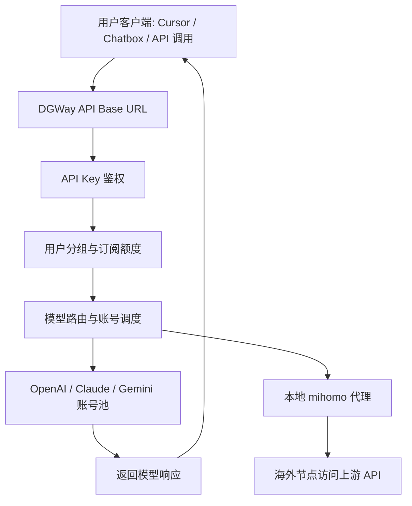
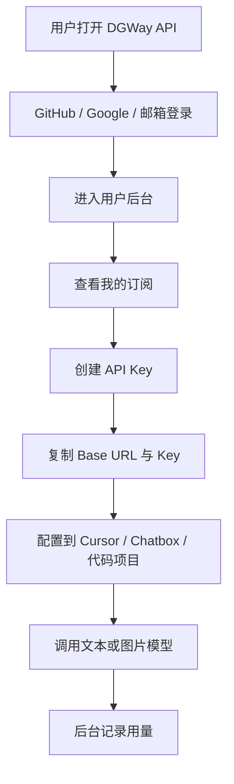

# DGWay API 设置与盈利

> 核心结论：DGWay API 现在已经完成“可运行、可测试、可登录、可调用”的雏形。下一阶段的重点不是继续堆功能，而是补齐域名与 HTTPS、稳定号池、用户分组与订阅额度、支付/兑换码、监控与风控。只要这些环节配置完整，它就可以从个人学习项目升级成可演示、可小范围运营的 AI API 中转站。

## 1. 当前项目状态

| 模块 | 当前状态 | 说明 |
| --- | --- | --- |
| 服务器 | 已部署 | LightNode 海外 Ubuntu 24.04，公网 IP：`149.104.69.175` |
| 访问入口 | 已可用 | 正式地址：`https://dgth.shop` |
| 后台入口 | 已可用 | 管理后台：`https://dgth.shop/admin/dashboard` |
| Sub2API 服务 | 已运行 | Docker 容器监听 `8080`，由 Nginx 代理到公网 80/443 |
| Nginx | 已运行 | 负责 HTTPS、HTTP 跳转 HTTPS、敏感探测路径拦截与反向代理 |
| 代理 | 已配置 | `mihomo-japan-local`，地址 `http://127.0.0.1:7890` |
| 账号池 | 已有测试账号 | 当前已有 1 个 OpenAI OAuth 账号，适合测试，不适合正式开放 |
| 图片生成 | 已验证 | `openai-default` 分组已允许图片生成，`gpt-image-2` 测试通过 |
| GitHub 登录 | 已配置 | DGWay 内部 callback 已更新为 `https://dgth.shop`，GitHub 控制台也要同步 |
| Google 登录 | 已配置 | DGWay 内部 callback 已更新为 `https://dgth.shop`，Google 控制台也要同步 |
| 域名/HTTPS | 已完成 | `dgth.shop` 和 `www.dgth.shop` 已签 Let’s Encrypt 证书 |
| 订阅套餐 | 已有雏形 | 当前已有 1 个上架套餐，后续还要补齐 trial / pro 等套餐 |
| 支付 | 已接入 JYLT 易支付 | 已支持 `epay.jylt.cc` 的商户号/通讯密钥模式，仍需用真实小额订单做一次端到端验证 |

## 2. 系统架构理解



这个系统的本质不是“自己训练模型”，而是把多个上游账号、订阅、模型权限、代理链路和用户 API Key 统一管理起来。用户只需要拿到一个 DGWay API Key，就可以通过 OpenAI-compatible 的方式调用模型。

## 3. 当前最缺的东西

### 3.1 域名与 HTTPS

当前已经切换到 `https://dgth.shop`。域名和 HTTPS 是正式使用的基础，原因有三个：

- GitHub OAuth 和 Google OAuth 都依赖精确 callback，域名变化后必须同步更新。
- Google OAuth 对 HTTP/IP 的兼容性较差，生产环境更推荐 HTTPS。
- 用户看到“不安全”会降低信任，也不适合写进简历或演示给他人。

当前统一使用：

| 项目 | 建议值 |
| --- | --- |
| 首页 | `https://dgth.shop/home` |
| API Base URL | `https://dgth.shop/v1` |
| GitHub callback | `https://dgth.shop/api/v1/auth/oauth/github/callback` |
| Google callback | `https://dgth.shop/api/v1/auth/oauth/google/callback` |
| DingTalk callback | `https://dgth.shop/api/v1/auth/oauth/dingtalk/callback` |

如果外部 OAuth 控制台仍填写旧 IP 或本地地址，登录会失败；后台配置和第三方控制台必须保持一致。

### 3.2 稳定号池

当前只有 1 个 OpenAI OAuth 账号，只能用于学习和验证流程。正式给小伙伴使用时，至少需要：

| 账号池配置 | 建议 |
| --- | --- |
| OpenAI 账号数量 | 至少 3 个以上，避免单账号限额或异常导致全站不可用 |
| 代理 | 每个账号绑定稳定代理，优先日本/新加坡低延迟节点 |
| 调度 | 开启调度，设置并发数、优先级、负载因子 |
| 模型白名单 | 只开放确认可用的模型，并写入分组自定义 `/v1/models` 列表，避免用户看到不可用模型 |
| 自动暂停 | 配置 5h / 7d 用量阈值，防止账号被打满 |

### 3.3 用户分组与订阅

这是“能不能给别人用”的核心。后台目前有分组，但还需要设计套餐与额度。

建议先做三个分组：

| 分组 | 目标用户 | 权限 |
| --- | --- | --- |
| `trial` | 试用用户 | 低额度，只开放文本模型 |
| `standard` | 普通付费用户 | 文本模型 + 少量图片生成 |
| `pro` | 高级用户 | 更高额度，开放更多模型和图片生成 |

### 3.4 支付与兑换码

当前已经接入 `epay.jylt.cc` 的易支付协议。短期仍建议保留“人工收款 + 兑换码/手动分配订阅”作为兜底，因为个人收款码通道可能受二维码、订单超时、回调重试影响。

推荐初期路径：

1. 用户联系管理员。
2. 管理员收款。
3. 管理员后台生成兑换码或直接分配订阅。
4. 用户登录 DGWay API。
5. 用户兑换套餐并生成 API Key。
6. 用户在 Cursor / Chatbox / 代码中配置 Base URL 和 API Key。

如果使用 JYLT 易支付自动收款，后台填写方式如下：

| 字段 | 填写 |
| --- | --- |
| Provider | `EasyPay` |
| API Style | `epay.jylt.cc` |
| 商户号 / `mchId` | 易支付后台“商户管理”里的商户 ID |
| 通讯密钥 / `secret` | 易支付后台显示的通讯密钥，只填后台，不写进文档或 Git |
| API Base | `https://epay.jylt.cc` |
| 异步回调 | `https://dgth.shop/api/v1/payment/webhook/easypay` |
| 同步回调 | `https://dgth.shop/payment/result` |
| 支付方式 | 勾选 `alipay` 和 `wxpay` |
| Payment Mode | `qrcode` |

JYLT 易支付的签名必须通过 `https://epay.jylt.cc/api/generateSign` 生成，不能本地直接 MD5。DGWay 已在服务端适配这一点。
JYLT 的 `qrcode` 模式只依赖异步回调入账，同步回调保持 `https://dgth.shop/payment/result` 这种短地址即可，不要填写带 `order_id` 或 `resume_token` 的长链接。
JYLT 返回的 `payUrl` 可能是二维码图片地址，DGWay 会从图片地址中提取真正的微信/支付宝支付码，不会让用户扫码后只打开二维码图片。

## 4. 管理后台配置清单

### 4.1 系统设置

位置：`管理后台 -> 系统设置`

重点配置：

| 配置项 | 建议 |
| --- | --- |
| 站点名称 | `DGWay API` |
| 站点副标题 | `Personal AI API Gateway` |
| Logo | 使用当前 D-logo |
| 注册开关 | 测试期可以打开，正式期建议配合风控 |
| GitHub 登录 | 域名 callback 正确后开启 |
| Google 登录 | HTTPS 完成后开启 |
| 文档地址 | 指向使用说明页或飞书文档 |
| API Base URL | `https://dgth.shop/v1` |

注意：后台管理员密码、OAuth Client Secret、代理订阅链接不建议写进公开文档。

### 4.2 分组管理

位置：`管理后台 -> 分组管理`

这是控制用户能用什么的地方。重点看：

| 配置项 | 用途 |
| --- | --- |
| 分组名称 | 用来区分 trial / standard / pro |
| 支持模型 | 控制用户能调用哪些模型 |
| 是否允许图片生成 | 控制 `gpt-image-2` 等图片接口能不能用 |
| 每日/每周/月度限额 | 控制成本和滥用 |
| 计费倍率 | 控制某些模型是否更贵 |
| 默认有效期 | 控制订阅到期时间 |

当前 `openai-default` 已允许图片生成，适合作为测试分组。正式运营建议不要所有用户都放进默认分组，而是创建清晰套餐分组。

### 4.3 账号管理

位置：`管理后台 -> 账号管理`

每一个上游账号都要检查：

| 检查项 | 目标状态 |
| --- | --- |
| 状态 | 正常 |
| 调度 | 开启 |
| 代理 | 绑定 `mihomo-japan-local` 或其他可用代理 |
| 模型白名单 | 包含实际可用模型；Antigravity 不要直接暴露默认模型池，只展示实测通过的模型 |
| 并发数 | 根据账号能力设置，测试期可低一点 |
| 负载因子 | 多账号时用于控制调度比例 |
| 自动暂停 | 建议开启，防止账号超额 |

当前测试模型包括：

- `gpt-5.4-mini`
- `gpt-image-2`
- 其他账号白名单中已添加的模型

### 4.4 订阅管理

位置：`管理后台 -> 订阅管理`

用途：给用户分配套餐和额度。

常见操作：

| 操作 | 用途 |
| --- | --- |
| 分配订阅 | 给指定用户开通某个套餐 |
| 到期时间 | 控制订阅有效期 |
| 状态 | 判断用户是否还能继续使用 |
| 用量 | 查看用户是否快用完额度 |

如果用户登录后无法使用，优先检查他有没有订阅、订阅是否过期、绑定分组是否有模型权限。

### 4.5 兑换码

位置：`管理后台 -> 兑换码`

适合早期盈利和小范围测试。推荐玩法：

- 创建“7 天试用码”。
- 创建“月卡兑换码”。
- 创建“测试额度兑换码”。
- 给小伙伴发兑换码，而不是直接给后台权限。

### 4.6 API 密钥

位置：

- 管理员：`管理后台 -> API 密钥`
- 用户：`我的账户 -> API 密钥`

用户最终拿到的是 `sk-...` 格式的 API Key。客户端填写：

| 项目 | 当前测试值 |
| --- | --- |
| Base URL | `https://dgth.shop/v1` |
| API Key | 用户自己的 `sk-...` |
| 文本模型 | `gpt-5.4-mini` |
| 图片模型 | `gpt-image-2` |

### 4.7 使用记录与运维监控

位置：

- `管理后台 -> 使用记录`
- `管理后台 -> 运维监控`

用途：

- 查看用户是否真的调用成功。
- 查看具体模型、耗时、错误码。
- 判断是用户 Key 问题、分组权限问题、账号池问题还是代理问题。
- 发现异常高频请求并及时限流。

## 5. 用户使用流程



给用户的最简说明：

1. 登录 DGWay API。
2. 进入“API 密钥”。
3. 创建一个 API Key。
4. 在客户端中填写：
   - Base URL：`https://dgth.shop/v1`
   - API Key：自己的 `sk-...`
   - 模型：`gpt-5.4-mini`
5. 如果要生成图片，模型选择 `gpt-image-2`，并确认自己的订阅分组允许图片生成。

## 6. 测试方法

### 6.1 文本模型测试

```bash
curl https://dgth.shop/v1/chat/completions \
  -H "Authorization: Bearer sk-你的APIKey" \
  -H "Content-Type: application/json" \
  -d '{
    "model": "gpt-5.4-mini",
    "messages": [
      {"role": "user", "content": "请回复 DGWay OK"}
    ]
  }'
```

### 6.2 图片模型测试

```bash
curl https://dgth.shop/v1/images/generations \
  -H "Authorization: Bearer sk-你的APIKey" \
  -H "Content-Type: application/json" \
  -d '{
    "model": "gpt-image-2",
    "prompt": "生成一张简洁的 DGWay API 科技风图标",
    "size": "1024x1024",
    "n": 1
  }'
```

如果图片接口报错，按顺序检查：

1. 用户 API Key 是否有效。
2. 用户是否有订阅。
3. 用户分组是否允许图片生成。
4. 账号白名单是否包含 `gpt-image-2`。
5. OpenAI 账号是否正常。
6. 代理是否可用。

## 7. 盈利模式设计

### 7.1 初期：人工售卖 + 兑换码

适合当前阶段，开发成本最低。

| 套餐 | 建议价格 | 适合人群 |
| --- | --- | --- |
| 试用包 | 免费或低价 | 朋友测试、演示 |
| 月度基础包 | 19-39 元/月 | 轻度 Cursor / Chatbox 用户 |
| 月度进阶包 | 59-99 元/月 | 高频开发、需要图片生成 |
| 按量加油包 | 10-50 元/次 | 用完额度后继续充值 |

早期不建议价格太复杂，先验证是否有人愿意用、愿意付费。

### 7.2 中期：订阅套餐 + 支付回调

当用户数量稳定后，可以接入 Stripe、Airwallex 或国内收款方案。目标是：

- 用户自助购买。
- 支付成功自动创建订阅。
- 到期自动停用。
- 后台可以查订单、退款、用量。

### 7.3 长期：面向团队的小型 API 网关

如果要写进简历，可以把项目定位成：

> 一个支持账号池调度、用户订阅、额度控制、OAuth 登录、模型权限、图片生成、代理出海、使用审计的 AI API Gateway。

简历亮点可以写：

- 独立部署开源 AI API Gateway。
- 配置 Nginx、PostgreSQL、Redis、mihomo 代理与系统服务。
- 支持 OpenAI-compatible API 调用。
- 实现用户分组、订阅额度、模型权限和使用审计。
- 支持 GitHub / Google OAuth 登录。
- 支持图片生成模型调度与成本控制。
- 设计商业化套餐、兑换码和风控策略。

## 8. 风险与控制

| 风险 | 表现 | 控制方法 |
| --- | --- | --- |
| 单账号不可用 | 所有请求失败 | 增加账号池，开启调度 |
| 代理失效 | 上游 403 / 连接失败 | 多代理节点，定期健康检查 |
| 用户滥用 | 成本暴涨 | 分组限额、API Key 限速、订阅额度 |
| OAuth 回调错误 | GitHub/Google 登录失败 | callback 必须和后台配置完全一致 |
| 图片生成成本高 | 额度消耗快 | 图片模型单独计费或只开放给高级套餐 |
| 密钥泄露 | Key 被别人刷 | 删除旧 Key，设置额度，监控异常使用 |
| IP 地址不安全 | 浏览器提示不安全 | 配域名和 HTTPS |

## 9. 下一步执行顺序

### 第一阶段：把测试链路跑稳

- 保持当前 IP 测试。
- 确认 GitHub 登录可进入用户后台。
- 创建 1 个测试用户。
- 给测试用户分配订阅。
- 让测试用户创建 API Key。
- 用文本模型和图片模型各测试一次。

### 第二阶段：补齐域名和 HTTPS（已完成）

- `dgth.shop` / `www.dgth.shop` 已解析到 `149.104.69.175`。
- Nginx HTTPS 已配置，HTTP 会跳转到 HTTPS。
- DGWay API 系统设置里的 Base URL 已更新为 `https://dgth.shop/v1`。
- GitHub / Google / DingTalk 的 DGWay 内部 callback 已更新。
- 仍需在 GitHub、Google、DingTalk 控制台同步填写新 callback。

### 第三阶段：设计套餐和盈利

- 创建 `trial`、`standard`、`pro` 分组。
- 当前已有 `Standard` 上架套餐，继续补齐试用包和进阶包。
- 创建兑换码。
- 在 `管理后台 -> 系统设置 -> 支付设置` 创建易支付服务商实例。如果是 `epay.jylt.cc`，选择 `API Style = epay.jylt.cc`，填写 `mchId`、`secret`、`API Base = https://epay.jylt.cc` 和 DGWay 回调地址。
- 让 3-5 个小伙伴试用。
- 观察错误率、成本和模型使用偏好。

### 第四阶段：稳定运营

- 扩充号池。
- 建立每日监控习惯。
- 定期备份数据库。
- 记录用户反馈。
- 把项目整理成简历项目和演示材料。

## 10. 当前建议

现在不要急着大范围开放。最稳妥的做法是：

1. 先用 IP 跑通“用户登录 -> 分配订阅 -> 创建 Key -> 文本调用 -> 图片调用”。
2. 再配置域名和 HTTPS。
3. 然后用兑换码给小伙伴测试。
4. 最后再考虑支付和盈利。

DGWay API 已经具备一个完整 AI 中转站的雏形。接下来要做的是把“能用”变成“稳定可控地给别人用”。

## 11. 当前模型与额度结论

用户侧“可用渠道”页面按常见中转模型目录展示：只给用户看模型名称、平台和定价，不展示后台分组名称。后台分组仍用于套餐、权限、调度和价格倍率，后续调整价格时在后台分组和渠道价格里处理。

### 11.1 GPT / OpenAI

当前确认展示给用户的模型：

| 类型 | 模型 |
| --- | --- |
| 聊天 | `gpt-5.6`、`gpt-5.6-sol`、`gpt-5.6-terra`、`gpt-5.6-luna`、`gpt-5.4`、`gpt-5.4-mini` |
| Codex | `gpt-5.3-codex-spark` |
| 图片生成 | `gpt-image-1`、`gpt-image-2` |

`gpt-5.6` 默认归一到 `gpt-5.6-sol`。`gpt-5.6-sol`、`gpt-5.6-terra`、`gpt-5.6-luna` 已加入本地候选列表和计费兜底，但 OpenAI OAuth 账号不能依赖“同步上游支持的模型”按钮实时获取，需要后台手动加入白名单。调用失败时先检查账号是否实际拥有 GPT-5.6 权限。

GPT 聊天、Codex、图片生成在 DGWay 里应该按不同模型和后台分组计费。图片生成要单独控制，因为成本更高，不建议默认开放给所有用户。

### 11.2 Gemini

当前普通 Gemini 入口只展示：

- `gemini-2.5-flash`
- `gemini-2.5-pro`

普通 Gemini OAuth 的图片模型本轮没有放进用户可见列表。原因是测试结果不稳定，直接展示给用户会增加误用和报错。

### 11.3 Antigravity

当前 Antigravity 入口展示 2026-06-03 实测通过的模型：

- `claude-haiku-4-5`
- `claude-haiku-4-5-20251001`
- `claude-opus-4-5-20251101`
- `claude-opus-4-5-thinking`
- `claude-opus-4-6`
- `claude-opus-4-6-thinking`
- `claude-opus-4-8-thinking`
- `claude-sonnet-4-6`
- `gemini-2.5-flash`
- `gemini-2.5-flash-lite`
- `gemini-2.5-flash-thinking`
- `gemini-3-flash`
- `gemini-3-flash-agent`
- `gemini-3-flash-preview`
- `gemini-3-pro-high`
- `gemini-3-pro-low`
- `gemini-3.1-flash-image`
- `gemini-3.1-flash-image-preview`
- `gemini-3-pro-image`
- `gemini-3-pro-image-preview`
- `gemini-3-pro-preview`
- `gemini-3.1-flash-lite`
- `gemini-3.1-pro-low`
- `gemini-3.5-flash-extra-low`
- `gemini-3.5-flash-low`
- `gemini-pro-agent`
- `gpt-oss-120b-medium`

当前不要展示或映射这些未通过项：`claude-opus-4-7`、`claude-opus-4-8`、`claude-sonnet-4-5`、`claude-sonnet-4-5-20250929`、`claude-sonnet-4-5-thinking`、`gemini-2.5-flash-image`、`gemini-2.5-flash-image-preview`、`chat_20706`、`chat_23310`、`gemini-2.5-pro`、`gemini-3.1-pro-high`、`gemini-3.1-pro-preview`。Claude Code 建议映射到本节已通过的 Claude 模型。

### 11.4 Gemini 与 Antigravity 额度

Gemini 和 Antigravity 即使用同一个 Google 账号登录，在 DGWay 中也按两个平台账号管理。不要默认认为普通 Gemini 文本额度会因为 Antigravity Claude Code 调用而同步减少。

更稳妥的运营方式：

1. Gemini 普通账号只放 `gemini-default` 分组。
2. Antigravity 账号只放 Antigravity 专用分组。
3. Claude Code 用户走 Antigravity 分组。
4. Gemini 文本用户走 Gemini 分组。
5. 图片生成只给明确允许图片的分组开放。

Google 官方没有给普通 OAuth 场景提供完整用量查询接口。后台显示的 Gemini 配额只能作为调度参考，最终以 Google 实际限流和报错为准。
